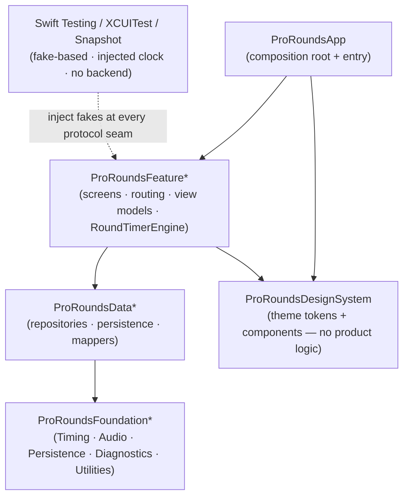

# ARCHITECTURE_GUIDE.md — ProRounds iOS App

This is the architecture source of truth for **ProRounds** — a local-first boxing round-timer app for iOS
(iOS 17+, SwiftUI). It is deliberately opinionated and, where practical, **mechanically enforced**: the module
graph compiles the layering, lint and coverage gates fail the build, and the patterns below are the canonical
ones — not a menu. Read it end-to-end before scaffolding a package, building a feature, or changing any
boundary. The short [`CLAUDE.md`](../CLAUDE.md) at the repo root defers here for detail.

The product spec (features, config fields, chart, settings, Phase 2) lives in
[`prorounds_app_prompt.md`](../prorounds_app_prompt.md). This guide is *how* we build it; that is *what* we build.

---

## 0. Operating principles — read first, apply always

These are **behaviours**, not architecture. Apply them every cycle, every conversation, every refactor. If you
violate them, the rest of this guide is wasted effort.

### 0.1 Always ask, never assume

If a requirement is ambiguous, a shape isn't documented, or the existing pattern doesn't unambiguously cover
the case — stop and ask via `AskUserQuestion`. Do not guess. Ask, never assume:

- The exact rule for a timer transition (is there a rest after the final round? does the warning fire on the
  last round? what happens if prep time is 0?).
- Whether a configuration field is optional / required / has a default, and the valid range for each.
- The navigation flow — which screen owns a route, what "back" does, what the tab bar contains.
- Which **layer** owns a responsibility (is this timer-engine logic, a repository concern, or view formatting?).
- Persistence semantics — what is saved, when, and what a partial/abandoned workout records.
- Error and interruption states (a phone call mid-round, headphones unplugged, app backgrounded) and how each
  should surface.

The cost of one clarifying question is minutes; the cost of building the wrong thing is days plus the trust hit
of redoing it. When you have multiple plausible interpretations, present them as choices — don't pick silently.

### 0.2 Think hard, validate every assumption

**Before writing code:** state your assumptions, then confirm them — read the type, read the protocol, run the
test, launch the simulator, watch the timer actually tick. Never build on "I think this works this way."

**Before claiming a task is done:** re-verify each assumption. Run the test. Launch the simulator and drive the
path — start a workout, pause it, background the app, resume, let a round end. Trigger the failure case. If you
skipped verification because "the change was small," verify it now — small changes break most because they get
the least scrutiny. A timer bug is invisible in a screenshot and obvious after 90 seconds of real running.

**Memory is a starting point, not a source of truth.** A note that names a type, file, or behaviour describes
the world *when it was written*. Confirm it still holds before acting on it.

**Smell list — if you think any of these, stop and validate:**
- "The remaining time is probably right after a pause." (Drive it and watch.)
- "It'll be accurate enough with a tick counter." (It won't — see §7.2; use a monotonic deadline.)
- "The layering is compile-enforced." (It is not — SwiftPM allows undeclared same-package imports.
  `ProRoundsArchitectureTests` is what checks it; keep the manifest honest.)
- "`@MainActor` is probably fine for the tick source." (Check the isolation.)
- "The test will catch a drift." (Only if it advances a fake clock and asserts on it — check.)

### 0.3 Every change updates `README.md`

`README.md` is a **living artefact**. Every change to how the app is built, run, configured, or tested updates
the README **in the same change set** — no exceptions. New package, new build/lint/coverage step, new run
command, new minimum Xcode/iOS version, new tool dependency, or an architecture decision worth recording (a
deviation from this guide, with rationale). Before declaring a task done, re-read the README and confirm it
still describes the app you just changed.

### 0.4 Code-craft principles — DRY · KISS · SOLID, Swift-idiomatically

Every line must satisfy these. When they conflict, state the trade-off and choose the option that best
preserves future change-ability.

- **DRY — one source of truth.** One model per concept; one `*Mapper` per boundary; one config value in one
  place (e.g. the total-duration calculation lives in *one* function, used by both the config preview and the
  running timer). Apply the **rule of three** before extracting a shared abstraction — never abstract for two.
- **KISS / YAGNI.** The simplest design that meets the requirement. A plain `struct` beats a protocol + generic
  until a *second concrete case actually exists*. No speculative generality. This is a timer app, not a
  distributed system — don't build for scale it will never see. (But *do* keep the Phase 2 seams from §9.)
- **SOLID, applied here:**
  - **S — Single Responsibility.** A `View` renders. A `ViewModel` holds screen state + intents. A `Repository`
    persists. A `Mapper` translates. The `RoundTimerEngine` sequences time. An `AudioCuePlayer` makes sound. If
    a type starts doing two of these, split it before adding more.
  - **O — Open/Closed.** Add behaviour by adding types (a new `WarningSound`, a new `AudioCuePlayer`), not by
    editing existing ones.
  - **L — Liskov.** Every concrete fully honours its protocol — no surprise `nil`, no surprise `throw`. A test
    written against the protocol passes against any conforming type (including the test fake).
  - **I — Interface Segregation.** Protocols are per-concern and hand-rolled. A screen depends only on the
    capabilities it uses.
  - **D — Dependency Inversion.** Depend on protocols, never concretions. Inject through initializers — **never**
    reach for a singleton or global. Concrete infrastructure is always behind a protocol an inner layer owns.

Follow the [Swift API Design Guidelines](https://www.swift.org/documentation/api-design-guidelines/). Prefer
value types and composition over inheritance.

### 0.5 Every change is runnable + testable locally

The whole test suite runs on any Mac or CI **with no network and no external state** — because the app *has* no
backend, this is the natural state, and it must stay that way. Everything with real-world side effects (the
passage of time, audio playback, persistence, and Phase-2 biometrics) sits behind a **protocol seam** with an
in-memory fake, so the suite is fast, hermetic, and deterministic. One command generates the project, builds,
and tests:

```bash
xcodegen generate && ./scripts/coverage.sh
```

If a change makes the app no longer testable in isolation — a `Date()`/`Task.sleep` reached directly instead of
an injected clock, real audio hardware in a unit test, a file written outside a temp/in-memory store — add the
seam (a protocol + a fake) alongside the change, and verify on a clean checkout before merging. Driving the real
app on a simulator is a separate, human-driven check — never a unit-test dependency.

### 0.6 Non-negotiable ProRounds invariants

These sit **above** §0.1–§0.5 when they conflict.

1. **Local-first, no backend, no login.** Configurations, sessions, and settings persist on-device via
   SwiftData / `UserDefaults`. The MVP makes no network calls and has no accounts. There is no server code path
   for core features, and one must not be added.
2. **Timer correctness is the product.** The workout clock is **deadline / monotonic-based, never an accumulated
   tick counter** (§7.2). It stays accurate across pause → resume, reset, every phase transition, app
   backgrounding, and audio interruptions. It never drifts, double-fires a cue, or loses/adds a round.
3. **The configured sequence is honoured exactly.** `prep → (round → rest) × N`, with **no rest after the final
   round**, and the round-end warning firing at exactly the configured lead time (and not at all when the lead
   time is 0). An off-by-one round or a stray final rest is a correctness bug, not a rounding nuance.
4. **Graceful behaviour under interruption.** Backgrounding, a phone call, a Siri interruption, or a headphone
   route change degrades gracefully — the workout is never silently corrupted, and cues resume correctly.
5. **Privacy & minimal data.** Collect only what a feature needs; no analytics of user activity, no PII, no
   third-party trackers. **(Phase 2)** WHOOP / HealthKit biometrics are sensitive health data — kept on-device,
   never logged, accessed only with explicit user consent, and easy to revoke.
6. **Both appearances, accessible.** Light and dark mode are both first-class. The black/red, cinematic
   theme still meets contrast, Dynamic Type, and VoiceOver expectations (§13).

#### The invariants, mapped onto this guide's sections

- **§3 Presentation / §11 Errors:** a `View` renders state and never computes timer transitions or formats raw
  errors; interruption states surface as clear, actionable UI.
- **§6 Data:** SwiftData `@Model` types never leak above the repository — repositories return value-type domain
  models. Nothing sensitive is logged.
- **§7 Timer engine:** the engine is pure, deterministic, and clock-injected; wall-clock time enters only
  through the `TimeSource` seam so tests are hermetic and drift is provable.
- **§8 Audio & background:** cues fire correctly with the screen locked (background-audio session) and recover
  from interruptions.
- **§9 Biometrics (Phase 2):** the boundary is fixed now, the runtime deferred; health data never leaves the
  device.
- **§12 Observability:** log identifiers, phases, and timings — never PII or (Phase 2) biometric values.

---

## 1. Architectural principles

### 1.1 Layered modules — the dependency rule

The app is four layers; **dependencies flow strictly downward**, never up or sideways across features:

```
App  →  Feature  →  Data  →  Foundation      (DesignSystem is Foundation-level, used by Feature + App)
```

- **App** — the composition root + entry point. Wires concrete implementations into protocols and injects them
  down. The only layer that knows every other.
- **Feature** — one vertical slice of product (a feature's screens, routing, and view models). A feature never
  imports another feature.
- **Data** — repositories, persistence, and the mappers that translate at those boundaries. Exposes protocols
  upward; hides SwiftData / `UserDefaults` from features.
- **Foundation** — cross-cutting capability with **no product logic**: the timing source, audio playback, the
  persistence container, diagnostics, utilities, and the design system. Reusable by any app.

A lower layer **cannot** import a higher one — and §2.1 makes that a *compile error*, not a guideline.

> **Where does the timer engine live?** The `RoundTimerEngine` (§7) is *product logic* — the round-sequencing
> rules — so it is **not** Foundation. It lives in the timer **Feature** (or a small shared `ProRoundsCore` if a
> second feature ever needs it). What it depends on downward is a Foundation seam: the `TimeSource` (§7.3) and
> the `AudioCuePlayer` (§8). Keep the *rules* in the feature and the *side effects* behind Foundation protocols.

### 1.2 Protocol-defined seams

Every cross-layer boundary is a **protocol** owned by the consuming (inner) side; the concrete implementation
lives in the outer layer and is injected at the composition root (§5.3). The protocol is simultaneously the
abstraction features depend on and the **mock seam** the tests inject a fake into (§14). If a boundary isn't a
protocol, it isn't a boundary — and it can't be tested in isolation. The four seams that matter most here:
`TimeSource`, `AudioCuePlayer`, `ConfigurationRepository`/`SessionRepository`, and (Phase 2) `BiometricSource`.

### 1.3 TDD is the inner development loop

Red → green → refactor on every feature, fix, and behaviour-affecting change. The primary surface is **Swift
Testing against fakes** — fast, hermetic, no real clock (§0.5, §14). No production code is written ahead of a
failing test that requires it. The timer engine in particular is **test-first, always** — its correctness is
the product, and it is trivial to test *only* because time enters through an injectable seam (§7.3, §14.1). UI
flows get XCUITest; design-system components get snapshot tests.

### 1.4 Testability and correctness are structural, not advisory

The reason the timer can be proven correct is *structural*: the engine cannot call `Date()` or `Task.sleep`
because it only holds a `TimeSource` protocol, and the test drives that seam by hand. Design so that the
testable thing is the *only* thing — a type that needs the wall clock takes it by injection, never reaches for
it. The same applies to audio (a fake records cues) and persistence (an in-memory container).



---

## 2. Project layout & modularization

The layering in §1.1 is enforced by the **SwiftPM package graph**: each layer×concern is a local package, and a
package can only reference packages it declares as dependencies — so a violation can't even build.

### 2.1 The package graph compile-enforces the layering

```
project.yml                      # XcodeGen — generates ProRounds.xcodeproj (git-ignored)
ProRounds/                       # ProRoundsApp: @main entry + the composition root
Packages/
├── ProRoundsFoundationUtilities/     # pure helpers, formatters, Duration math (no deps)
├── ProRoundsFoundationDiagnostics/   # OSLog wrappers, signposts
├── ProRoundsFoundationTiming/        # TimeSource seam (ContinuousClock / timer) — the injectable clock
├── ProRoundsFoundationAudio/         # AudioCuePlayer seam (AVFoundation) + AVAudioSession config
├── ProRoundsFoundationPersistence/   # SwiftData ModelContainer provider
├── ProRoundsFoundationHealth/        # (Phase 2) BiometricSource seam — WHOOP / HealthKit
├── ProRoundsDesignSystem/            # theme tokens (black/red) + reusable components
├── ProRoundsDataConfig/              # ConfigurationRepository + SwiftData model + mapper
├── ProRoundsDataSessions/            # SessionRepository + SwiftData model + mapper
├── ProRoundsDataSettings/            # SettingsRepository (UserDefaults-backed)
├── ProRoundsFeatureTimer/            # config-select + running the workout + RoundTimerEngine
├── ProRoundsFeatureConfig/           # create / edit / list configurations
├── ProRoundsFeaturePerformance/      # sessions chart page
└── ProRoundsFeatureSettings/         # settings screen
```

A `Package.swift` declares exactly which packages a target may import. A Foundation package that tried to
`import ProRoundsFeatureTimer` would not list it as a dependency — and would fail to compile:

```swift
// Packages/ProRoundsFeatureTimer/Package.swift
let package = Package(
    name: "ProRoundsFeatureTimer",
    platforms: [.iOS(.v17)],
    products: [.library(name: "ProRoundsFeatureTimer", targets: ["ProRoundsFeatureTimer"])],
    dependencies: [
        .package(path: "../ProRoundsDataConfig"),      // ↓ may reach Data
        .package(path: "../ProRoundsDataSessions"),
        .package(path: "../ProRoundsFoundationTiming"), // ↓ the injectable clock seam
        .package(path: "../ProRoundsFoundationAudio"),  // ↓ the audio seam
        .package(path: "../ProRoundsDesignSystem"),     // → the design system
        // NOTE: no sibling ProRoundsFeature*. A feature cannot import another feature. The graph forbids it.
    ],
    targets: [
        .target(name: "ProRoundsFeatureTimer", dependencies: [
            .product(name: "ProRoundsDataConfig", package: "ProRoundsDataConfig"),
            .product(name: "ProRoundsDataSessions", package: "ProRoundsDataSessions"),
            .product(name: "ProRoundsFoundationTiming", package: "ProRoundsFoundationTiming"),
            .product(name: "ProRoundsFoundationAudio", package: "ProRoundsFoundationAudio"),
            .product(name: "ProRoundsDesignSystem", package: "ProRoundsDesignSystem"),
        ]),
        .testTarget(name: "ProRoundsFeatureTimerTests", dependencies: ["ProRoundsFeatureTimer"]),
    ]
)
```

**Pragmatic path (KISS).** This is a small app — start with a handful of packages (or even a single app target
with folders named for these seams) and split along them as the app grows. The *direction* is enforced from the
first split onward — never let a lower layer take a dependency on a higher one to "get it working." At minimum,
`ProRoundsFoundationTiming` and `ProRoundsFoundationAudio` should be their own seams from day one, because the
timer engine's tests depend on injecting fakes for them.

### 2.2 Naming convention — `ProRounds<Layer><Feature>`

```
ProRounds<Layer><Feature>
  ProRoundsFeatureTimer        ProRoundsFeatureConfig       ProRoundsFeaturePerformance
  ProRoundsDataSessions        ProRoundsDataConfig          ProRoundsDataSettings
  ProRoundsFoundationTiming    ProRoundsFoundationAudio     ProRoundsFoundationPersistence
  ProRoundsDesignSystem        ProRoundsApp
```

The package name states the layer (so an import line reveals a layering violation at a glance) and the concern.

### 2.3 File-suffix conventions — **enforce these**

One responsibility per type; the suffix names it. SwiftLint file-name + custom rules enforce these (§15.2).

| Role                                | Suffix         | Example                                             |
|-------------------------------------|----------------|-----------------------------------------------------|
| SwiftUI view (dumb)                 | `View`         | `WorkoutView`, `ConfigListView`                     |
| Screen state + intents              | `ViewModel`    | `WorkoutViewModel`, `PerformanceViewModel`          |
| Navigation route (enum)             | `Route`        | `TimerRoute`                                         |
| Feature navigation owner            | `Router`       | `TimerRouter`                                        |
| Repository protocol + impl          | `Repository`   | `SessionRepository`, `SwiftDataSessionRepository`   |
| The round-sequencing state machine  | `Engine`       | `RoundTimerEngine`                                  |
| Injectable time seam                | `Source`       | `TimeSource`, `SystemTimeSource`, `FakeTimeSource`  |
| Audio / SDK wrapper                 | `Player`/`Client` | `AudioCuePlayer`, `AVAudioCuePlayer`             |
| Persisted-prefs store               | `Store`        | `SettingsStore`                                     |
| Boundary translation                | `Mapper`       | `ConfigurationMapper`                               |
| View-ready value                    | `DisplayModel` | `WorkoutDisplayModel`                               |
| Domain / value model                | `Model` (or none) | `Configuration`, `Session`, `WorkoutType`        |
| SwiftData persisted entity          | `Entity`       | `ConfigurationEntity`, `SessionEntity`              |
| Swift Testing suite                 | `Tests`        | `RoundTimerEngineTests`                             |

> Naming the SwiftData `@Model` classes `*Entity` and the domain value types `*Model` (or bare) keeps the two
> distinct and makes a leak of a persistence type above the repository obvious on sight (§6.1).

### 2.4 What lives in each layer

- **App (`ProRoundsApp`)** — the `@main` entry, the composition root (§5.3), app-lifecycle wiring, the root tab
  bar, and the theme application (`preferredColorScheme`). No product rules.
- **Feature (`ProRoundsFeature*`)** — a vertical slice: its `*View`s, `*ViewModel`s, `*Route`/`*Router`, display
  mapping, and (for Timer) the `RoundTimerEngine`. Depends on Data protocols + Foundation seams + DesignSystem.
  Never imports another feature.
- **Data (`ProRoundsData*`)** — repository protocols + their SwiftData/`UserDefaults` implementations, plus the
  `*Mapper`s that translate `@Model` entity ↔ domain value model. Hides persistence from features.
- **Foundation (`ProRoundsFoundation*`)** — cross-cutting capability with **no product logic**: `Timing`
  (the `TimeSource` seam), `Audio` (playback + `AVAudioSession`), `Persistence` (the `ModelContainer`),
  `Diagnostics`, `Utilities`, and (Phase 2) `Health`.
- **DesignSystem (`ProRoundsDesignSystem`)** — theme tokens (black/red, cinematic), reusable components,
  snapshot-tested. Foundation-level; importable by Feature + App; holds no product logic.

### 2.5 The composition root

Only **`ProRoundsApp`** assembles the object graph — it builds concretes and injects them, protocol-typed, down
into features. Nothing below App constructs a sibling concrete or reaches for a singleton (§5).

```swift
@main
struct ProRoundsApp: App {
    private let environment = AppEnvironment.live()   // builds the graph once

    var body: some Scene {
        WindowGroup { RootTabView(environment: environment) }
    }
}

/// The composition root: concrete implementations chosen here, exposed as protocols.
struct AppEnvironment {
    let configRepository: ConfigurationRepository
    let sessionRepository: SessionRepository
    let settings: SettingsStore
    let timeSource: TimeSource
    let audio: AudioCuePlayer

    static func live() -> AppEnvironment {
        let container = try! PersistenceContainer.makeDefault()   // ProRoundsFoundationPersistence
        return AppEnvironment(
            configRepository: SwiftDataConfigurationRepository(container: container),
            sessionRepository: SwiftDataSessionRepository(container: container),
            settings: UserDefaultsSettingsStore(),
            timeSource: SystemTimeSource(),                        // wraps ContinuousClock
            audio: AVAudioCuePlayer()
        )
    }
}
```

In tests the composition root is replaced by fakes — `AppEnvironment(timeSource: FakeTimeSource(), audio:
SpyAudioCuePlayer(), …)` — because every field is a protocol (§5.5, §14.3).

---

## 3. Presentation layer

SwiftUI + the **Observation framework** (`@Observable`). No `ObservableObject`/Combine for new code. One view
model per screen; views are declarative and dumb.

### 3.1 Views are dumb

A `*View` renders state and forwards intents. No product logic, no timer math, no formatting, no persistence, no
`Task` orchestration beyond a lifecycle `.task`. If a view needs a derived value (the `mm:ss` string, the ring
progress fraction, the round label), it comes pre-computed on a `*DisplayModel` (§3.3).

```swift
struct WorkoutView: View {
    @State private var model: WorkoutViewModel        // owned here, injected at construction

    var body: some View {
        VStack(spacing: Spacing.lg) {
            PhaseBadge(text: model.display.phaseLabel)          // "Round 3 of 12" — a DesignSystem component
            TimerRing(progress: model.display.progress,
                      label: model.display.timeLabel)           // pre-formatted "mm:ss"
            Text(model.display.totalRemainingLabel)
            TransportControls(isRunning: model.display.isRunning,
                              onPlayPause: { Task { await model.togglePause() } },
                              onReset:     { Task { await model.reset() } })
        }
        .task { await model.onAppear() }                        // lifecycle only
    }
}
```

### 3.2 `@MainActor @Observable` view models — the canonical pattern

One view model per screen, `@MainActor`-isolated, holding `private(set)` state and exposing intents. It depends
on **protocols** (injected via `init`) and drives the `RoundTimerEngine`; it never sequences time itself.

```swift
@MainActor @Observable
final class WorkoutViewModel {
    private(set) var display: WorkoutDisplayModel = .idle

    private let engine: RoundTimerEngine                         // the state machine (§7)
    private let sessions: SessionRepository                      // to save on completion (§6)
    private let countDirection: CountDirection                  // from settings (§5)
    private var observationTask: Task<Void, Never>?

    init(configuration: Configuration,
         engine: RoundTimerEngine,
         sessions: SessionRepository,
         countDirection: CountDirection) {
        self.engine = engine
        self.sessions = sessions
        self.countDirection = countDirection
    }

    func onAppear() async {
        observationTask = Task { [weak self] in
            guard let self else { return }
            for await snapshot in await engine.snapshots {        // engine emits WorkoutSnapshot values
                self.display = WorkoutDisplayModel(snapshot, direction: countDirection)
                if case .finished = snapshot.phase {
                    try? await self.sessions.save(Session(snapshot))   // persist the completed session
                }
            }
        }
        await engine.start()
    }

    func togglePause() async { await engine.togglePause() }
    func reset() async       { await engine.reset() }

    deinit { observationTask?.cancel() }
}
```

State is `private(set)` so only intents mutate it. The view observes automatically. **Never** put timer
sequencing, audio, or persistence logic here — delegate to the engine and the repository.

### 3.3 Display models + mapping

Map domain models → view-ready `*DisplayModel` (formatted `mm:ss`, the round label, the progress fraction, and
the count-up-vs-count-down choice) in a `*Mapper` or a `DisplayModel.init(_:)`, **outside the view**. The view
never calls a formatter and never decides whether to show elapsed or remaining — the mapper does, from the
`CountDirection` setting.

```swift
struct WorkoutDisplayModel: Equatable {
    let phaseLabel: String       // "Prepare", "Round 3 of 12", "Rest"
    let timeLabel: String        // "01:23" — already formatted; count-up or count-down resolved here
    let totalRemainingLabel: String
    let progress: Double         // 0…1 for the ring
    let isRunning: Bool
}
```

### 3.4 Navigation — `NavigationStack` + enum routes, `TabView` at the root

The root is a `TabView` (Timer, Performance, Settings — the chart tab uses the chart-outline icon from the
spec). Each feature owns an enum `*Route` and a `*Router` driving its own `NavigationStack`. Type-safe,
testable; **no UIKit coordinators**.

```swift
enum TimerRoute: Hashable {
    case configEditor(Configuration.ID?)   // nil = new configuration
    case running(Configuration.ID)
}
```

### 3.5 State, side effects, cancellation

- Use `.task {}` for appear-scoped work; SwiftUI cancels it on disappear.
- The view model owns the long-lived engine-observation `Task` and cancels it (`deinit`). Capture `self` weakly.
- **Keep the screen awake while a workout runs** (`UIApplication.shared.isIdleTimerDisabled` via a small
  Foundation seam, re-enabled on finish/leave) — a black screen mid-round is a product bug.
- Derive, don't store: computed display values come from the mapper, not duplicated `@State`.

### 3.6 Anti-patterns — refuse them

- Timer math, `DateFormatter`, or `Timer.scheduledTimer` inside a `*View` or view model (that's the engine).
- `ObservableObject` + `@Published` + Combine for new screens (use `@Observable`).
- A "massive view model" that also sequences time / plays audio / writes SwiftData — push those to the engine,
  the audio player, and the repository.
- A domain type (`Configuration`, `Session`) used directly in a view — map to a `*DisplayModel` first.
- Mutating a child `NavigationPath` from deep views instead of through the feature `Router`.

---

## 4. Concurrency model

Swift 6 language mode with **complete concurrency checking**. Mutable infrastructure state is owned by `actor`s;
UI is `@MainActor`; everything crossing an isolation boundary is `Sendable`.

### 4.1 Swift 6 strict concurrency

Build under Swift 6 language mode with `-strict-concurrency=complete`. Data-race safety is a **compile error**,
not a runtime hope. `@unchecked Sendable` is forbidden without a written justification comment pointing at the
exact lock/serialization that makes the type safe.

### 4.2 Actors for stateful infrastructure

Anything with mutable state shared across tasks is an `actor`: the `RoundTimerEngine` (it holds the running
phase, deadlines, and pause state — §7), the `TimeSource` tick loop, and the `AudioCuePlayer` if it queues.
The actor serializes access; callers `await` in.

```swift
actor RoundTimerEngine {
    private var state: EngineState                 // mutable — protected by actor isolation
    private let time: TimeSource                   // injected seam (§7.3)
    private let audio: AudioCuePlayer              // injected seam (§8)
    private var continuation: AsyncStream<WorkoutSnapshot>.Continuation?
    // start / pause / resume / reset / tick handling … (§7)
}
```

### 4.3 `@MainActor` for UI

View models and view-facing types are `@MainActor`. They `await` into the engine/actors and never block the
main actor with synchronous work. Snapshots crossing from the engine to the view model are `Sendable` value
types, so there is no "dispatch back to main" boilerplate.

### 4.4 Structured concurrency

Prefer structured work. Retain a `Task` only for the genuinely long-lived engine-snapshot stream, and tie its
lifetime to the owner (cancel in `deinit`/on disappear). Don't spawn detached `Task {}`s that outlive their
context — a leaked timer task that keeps firing cues is exactly the bug to avoid.

### 4.5 Pitfalls — refuse them

- `@unchecked Sendable` to silence a warning instead of fixing the isolation.
- An unstructured `Task {}` running the timer loop that outlives the screen and keeps ticking/beeping.
- Blocking the main actor with synchronous audio-session or file work.
- Capturing `self` strongly in the retained snapshot task (retain cycle / leaked work).

---

## 5. Dependency injection & composition

Manual **constructor injection** and a single composition root. No singletons, no globals, no service locator,
no DI framework. Every boundary is a protocol so tests inject fakes (§14).

### 5.1 Constructor injection only

Dependencies are protocol-typed `init` parameters. A type cannot acquire a collaborator any other way — no
`.shared`, no global. This makes the dependency graph explicit and every type trivially testable.

```swift
// Good — the clock is a protocol parameter, so a test can inject a fake and control time.
init(configuration: Configuration, time: TimeSource, audio: AudioCuePlayer) { … }

// Refuse — reaching for the wall clock directly makes the engine untestable and non-deterministic.
// let now = Date()   // ← forbidden inside the engine
```

### 5.2 Protocol-per-boundary

Each Data/Foundation capability is a protocol (`ConfigurationRepository`, `SessionRepository`, `SettingsStore`,
`TimeSource`, `AudioCuePlayer`, and Phase-2 `BiometricSource`). The concrete lives behind it in the outer layer.
Inner layers depend only on the protocol.

### 5.3 The composition root

`ProRoundsApp` builds the object graph once (§2.5) and injects it down. A small factory turns the environment
into view models so features don't construct engines/repositories themselves:

```swift
@MainActor
struct ViewModelFactory {
    let environment: AppEnvironment
    func workout(_ config: Configuration) -> WorkoutViewModel {
        let engine = RoundTimerEngine(configuration: config,
                                      time: environment.timeSource,
                                      audio: environment.audio)
        return WorkoutViewModel(configuration: config,
                                engine: engine,
                                sessions: environment.sessionRepository,
                                countDirection: environment.settings.countDirection)
    }
}
```

### 5.4 SwiftUI wiring

Pass view models by `init` and own them with `@State` at the screen root. Use `@Environment` **only** for
genuinely ambient values (color scheme, locale) — never as a DI backdoor to smuggle services past the
composition root.

### 5.5 Test seams

Because every boundary is a protocol, the suite injects in-memory fakes: `FakeTimeSource` (the test advances
time by hand), `SpyAudioCuePlayer` (records the cues fired, in order), an in-memory `ModelContainer`, and an
in-memory `SettingsStore`. No real clock, no audio hardware, no disk. If you want to mock a concrete type, the
missing thing is a protocol seam — add it.

### 5.6 Anti-patterns — refuse them

- `static let shared` singletons; global mutable state; service locators.
- A DI framework — constructor injection + the composition root is enough (KISS).
- Reaching for `@Environment` to inject a service instead of passing it through `init`.
- A view model constructing its own engine's `TimeSource` from the wall clock (hidden dependency, untestable).

---

## 6. Data layer

The Data layer hides SwiftData and `UserDefaults` behind **repository/store protocols**. Features depend on the
protocols; they never see a `ModelContext`, a `@Model` class, or a `UserDefaults` key.

### 6.1 Repository protocols — the Data boundary

A repository exposes domain operations and returns **value-type domain models**, never SwiftData entities.
Concrete implementations live in `ProRoundsData*`; features import only the protocol.

```swift
protocol ConfigurationRepository: Sendable {
    func all() async throws -> [Configuration]
    func save(_ configuration: Configuration) async throws     // insert or update
    func delete(_ id: Configuration.ID) async throws
}

protocol SessionRepository: Sendable {
    func save(_ session: Session) async throws
    func all() async throws -> [Session]
    func byWorkoutType() async throws -> [WorkoutType: [Session]]   // feeds the performance chart (§ prompt)
}
```

### 6.2 SwiftData — the local store

One SwiftData `ModelContainer`, created in `ProRoundsFoundationPersistence`; repositories in `ProRoundsData*`
use it. No encryption is required — ProRounds stores non-sensitive workout data, so SwiftData's default store is
appropriate (contrast: an E2EE messenger would need SQLCipher; ProRounds does not, and adding it would be
YAGNI). **(Phase 2)** if biometric history is ever persisted, revisit at-rest protection then.

```swift
// ProRoundsFoundationPersistence — the only place the container is configured.
enum PersistenceContainer {
    static func makeDefault() throws -> ModelContainer {
        try ModelContainer(for: ConfigurationEntity.self, SessionEntity.self)
    }
    static func makeInMemory() throws -> ModelContainer {          // for tests (§14.3)
        try ModelContainer(for: ConfigurationEntity.self, SessionEntity.self,
                           configurations: ModelConfiguration(isStoredInMemoryOnly: true))
    }
}
```

### 6.3 Entities, domain models, mappers

The `@Model` `*Entity` classes live inside the Data package and never escape it. A `*Mapper` translates entity ↔
domain value model so SwiftData reference types never leak above the repository (and never cross an actor
boundary — they aren't `Sendable`).

```swift
@Model final class ConfigurationEntity {
    @Attribute(.unique) var id: UUID
    var name: String
    var workoutTypeRaw: String
    var roundCount: Int
    var roundSeconds: Int
    var restSeconds: Int
    var prepSeconds: Int
    var warningLeadSeconds: Int
    // init …
}

struct Configuration: Identifiable, Equatable, Sendable {   // the domain value model features use
    let id: UUID
    var name: String
    var workoutType: WorkoutType
    var roundCount: Int
    var roundDuration: Duration
    var restDuration: Duration
    var prepDuration: Duration
    var warningLead: Duration          // 0 = no warning
}
```

### 6.4 Settings store

Non-sensitive preferences (`WarningSound`, `CountDirection`, theme/`ColorSchemePreference`) live behind a
`SettingsStore` protocol backed by `UserDefaults`. Small, synchronous, and injected like everything else — never
read from `UserDefaults.standard` directly in a feature.

### 6.5 Derived values have one home

The **total workout duration** and the **auto-generated configuration name** (from workout type, rounds, round
duration, rest — per the prompt) are each computed in exactly one place in `ProRoundsFoundationUtilities` (or on
`Configuration`), used by both the config preview and the running timer. Don't recompute the total in the view.

### 6.6 Anti-patterns — refuse them

- A `@Model` `*Entity` or a `ModelContext` leaking above the repository protocol.
- Reading `UserDefaults.standard` (or a raw key) from a feature instead of the `SettingsStore`.
- Duplicating the total-duration or auto-name calculation in a view or view model.
- A second source of truth that can drift from the store.

---

## 7. The Round Timer engine — the core boundary

This is ProRounds' defining component, and it gets the most scrutiny and the most tests. The engine is a
**deterministic state machine** over an **injected time source**; it sequences the configured workout, fires
audio cues at the right instants, and emits `Sendable` snapshots the UI observes.

### 7.1 The phase state machine

```swift
enum WorkoutPhase: Equatable, Sendable {
    case preparing                 // before round 1 (skipped when prep == 0)
    case round(index: Int)         // 1-based
    case resting(afterRound: Int)  // never emitted after the final round
    case finished
}

struct WorkoutSnapshot: Equatable, Sendable {
    let phase: WorkoutPhase
    let remaining: Duration        // remaining in the current phase
    let elapsedInPhase: Duration
    let elapsedTotal: Duration
    let totalDuration: Duration
    let roundCount: Int
    let isPaused: Bool
}
```

The sequence is **exactly** `prep → (round → rest) × N` with **no rest after round N** (invariant §0.6.3). The
engine exposes `start()`, `togglePause()` (pause/resume), and `reset()`, and a `snapshots` stream.

### 7.2 Monotonic deadlines, never a tick accumulator — the correctness rule

Each phase has an **absolute deadline** computed from a monotonic clock instant, not a running sum of tick
deltas. On each tick, `remaining = deadline - now`; when `now >= deadline`, transition and set the next
deadline. This is why the timer stays accurate across a slow tick, a backgrounded app, or a dropped frame — the
deadline is ground truth. A naive `remaining -= 1` on every tick **accumulates drift** and desynchronises from
the wall clock; it is forbidden. Pause captures `remaining`; resume rebuilds the deadline as `now + remaining`.

### 7.3 `TimeSource` — the injectable seam (why the engine is testable)

The engine never touches `Date`, `ContinuousClock`, or `Task.sleep` directly. It holds a `TimeSource`:

```swift
protocol TimeSource: Sendable {
    func now() -> ContinuousClock.Instant           // monotonic; immune to wall-clock changes
    /// A tick stream the engine drives its updates from (~10–20 Hz for a smooth ring).
    func ticks(interval: Duration) -> AsyncStream<ContinuousClock.Instant>
}
```

- **`SystemTimeSource`** (in `ProRoundsFoundationTiming`) wraps `ContinuousClock` and a repeating timer.
- **`FakeTimeSource`** (in tests) lets a test set `now` and emit ticks by hand — so an entire 12×3-minute
  workout is verified in microseconds, deterministically, with the cue order asserted exactly (§14.1).

This single seam is what makes invariant §0.6.2 (timer correctness) *provable* rather than hoped-for.

### 7.4 Audio cues fire from the engine

The engine calls the `AudioCuePlayer` (§8) at transition instants and at the warning lead time: round start,
round-end warning (at `deadline - warningLead`, only if `warningLead > 0`), round end / rest start, and workout
complete. Cues are driven by phase transitions in the engine — **not** by the view, so they fire even with the
screen locked (§8.2). The engine decides *when*; the player decides *how it sounds*.

### 7.5 Background & interruption behaviour

- While running, an **active audio session with background-audio capability** keeps ticks and cues alive with
  the screen locked (§8.2). Because timing is deadline-based (§7.2), a resume after any gap recomputes remaining
  correctly rather than trusting a paused counter.
- On an **AVAudioSession interruption** (a call), the engine pauses cleanly and resumes on the `.ended`
  notification; the workout is never silently corrupted (invariant §0.6.4).

### 7.6 Count-up vs count-down is a *display* concern

The engine always knows both `elapsedInPhase` and `remaining`. Which one the user sees is resolved in the
`WorkoutDisplayModel` from the `CountDirection` setting (§3.3) — the engine's rules never branch on it.

### 7.7 Anti-patterns — refuse them

- `remaining -= 1` tick accumulation, or any timing derived from `Date()` differences instead of a monotonic
  instant (drift — §7.2).
- A rest emitted after the final round, or an off-by-one round count.
- The engine reaching for `Task.sleep`/`Timer`/`ContinuousClock` directly instead of the injected `TimeSource`.
- Firing cues from the `View`/view model instead of the engine (silent when the screen locks).
- Branching the engine's sequencing on the count-up/count-down or theme setting (that's presentation).

---

## 8. Audio & background behaviour

Sound is a first-class product feature (bell, rest signals, the configurable warning sound). It sits behind a
narrow protocol so the engine stays pure and tests assert on cues without touching audio hardware.

### 8.1 `AudioCuePlayer` — the seam

```swift
enum WarningSound: String, Codable, CaseIterable, Sendable {
    case woodenClap, electronicHorn, buzzer     // the three options from the spec
}

enum AudioCue: Equatable, Sendable {
    case roundStart, roundEndWarning(WarningSound), roundEnd, restStart, workoutComplete
}

protocol AudioCuePlayer: Sendable {
    func prepare() async                        // preload buffers so the first cue isn't late
    func play(_ cue: AudioCue) async
}
```

`AVAudioCuePlayer` (in `ProRoundsFoundationAudio`) preloads bundled sound assets and plays them with low
latency. Tests inject a `SpyAudioCuePlayer` that records `played: [AudioCue]` in order (§14.3).

### 8.2 Audio session & background audio

- Configure `AVAudioSession` for `.playback` so cues sound even with the ringer silent, and declare the
  **`audio` background mode** (`UIBackgroundModes`) so the running workout keeps firing cues with the screen
  locked. This is the concrete decision behind the "background timer accuracy" question flagged in the prompt —
  resolve it explicitly before shipping.
- Choose the mix behaviour deliberately: **duck** other audio (music) briefly for a cue, or interrupt — confirm
  the desired feel via `AskUserQuestion` if unspecified (§0.1).
- Handle **route changes** (headphones unplugged) and **interruptions** (calls) per §7.5.

### 8.3 Assets

Bundled, compressed sound files for each `WarningSound` plus the round bell. Preloaded via `prepare()` so the
first cue is on time. No network fetch.

### 8.4 Anti-patterns — refuse them

- The engine or a view importing `AVFoundation` directly instead of the `AudioCuePlayer` seam.
- Firing a cue on a `Timer` in the view (drifts from the engine; silent when backgrounded).
- Blocking the main actor loading a sound file (preload off-main via `prepare()`).
- Ignoring interruptions/route changes so a call leaves the workout in a broken audio state.

---

## 9. Biometrics / WHOOP boundary (Phase 2 — forward-looking)

Live heart-rate and WHOOP trends are **Phase 2** (see the prompt). Do **not** implement them now, but fix the
seam so adding them later is an open/closed change that touches no existing feature.

### 9.1 `BiometricSource` — the boundary

```swift
protocol BiometricSource: Sendable {
    /// Streams heart-rate samples during a workout. No-op / empty in the MVP.
    func heartRate() -> AsyncStream<HeartRateSample>
}
```

Lives in `ProRoundsFoundationHealth`. In the MVP the composition root can inject a `NullBiometricSource` (empty
stream) so the timer feature already tolerates its absence. The concrete runtime — WHOOP OAuth + API, or
HealthKit — is deferred to its slice.

### 9.2 Privacy — biometrics never leave the device

Heart-rate and WHOOP data are **sensitive health data**: kept on-device, never logged (§12), accessed only with
explicit user consent, and revocable. WHOOP OAuth tokens (when added) live in the **Keychain**, never
`UserDefaults`. This is the one place ProRounds handles genuinely sensitive data — treat it accordingly
(invariant §0.6.5).

### 9.3 Anti-patterns — refuse them

- Building WHOOP/HealthKit into a feature now instead of behind the `BiometricSource` seam (YAGNI + churn).
- Logging or analytics of heart-rate values.
- WHOOP tokens in `UserDefaults`/a plist/source.

---

## 10. Error handling & resilience

Errors are typed per boundary, surfaced to the user as clear state, and never silently swallowed. A workout
should be hard to break and, when it breaks, obvious.

### 10.1 Typed errors per boundary

Each protocol declares a typed `Error`; map at boundaries so a SwiftData or audio error never reaches a view as
a raw string.

```swift
enum PersistenceError: Error, Equatable { case notFound, saveFailed }
```

### 10.2 User-facing surfacing

Errors reach the user as **actionable state on the view model** (a toast, an inline message with retry) — never
a raw library error string. A failed save of a completed session should tell the user, not vanish.

### 10.3 Interruptions degrade gracefully

A call, backgrounding, or a route change pauses cleanly and resumes (§7.5) — not a crash, a frozen timer, or a
silently corrupted round. The reset/pause/resume controls always reflect the true engine state.

### 10.4 Retry vs fail-fast

- **Retry** transient persistence/audio-session hiccups where a retry can plausibly succeed.
- **Fail-fast** on programmer errors (an invalid configuration that validation should have caught upstream).
- **Never silently drop a completed session** — if the save fails, surface it with a retry.

### 10.5 Anti-patterns — refuse them

- `try?` that swallows a save error into `nil` with no surfacing.
- Force-unwrapping (`!`) decoded/persisted data.
- Surfacing a raw `Error` description to the UI.
- A validation gap that lets a 0-round or negative-duration configuration reach the engine.

---

## 11. Configuration validation

Because the engine trusts its input, validate configurations at the boundary where they're created/edited, and
keep the rules in one place.

- **Ranges:** `roundCount ≥ 1`; `roundDuration > 0`; `restDuration ≥ 0`; `prepDuration ≥ 0`;
  `0 ≤ warningLead < roundDuration` (a warning can't exceed a round). Confirm exact bounds via `AskUserQuestion`
  if the product owner has preferences (§0.1).
- **Auto-name** falls back to a meaningful generated name (workout type · rounds×duration / rest) when the user
  leaves the name blank (§6.5, per the prompt).
- Validation lives in one validator used by the config editor's view model and asserted directly in tests — the
  engine assumes valid input and does not re-validate.

---

## 12. Observability

Logging and signposts that help debugging **without recording PII or (Phase 2) biometric values**.

### 12.1 Structured logging

Use `OSLog`/`Logger` with a subsystem + per-module category. Log phase transitions, timings, and identifiers —
never health data.

```swift
let log = Logger(subsystem: "com.prorounds.app", category: "timer")
log.info("phase=\(phase.label, privacy: .public) round=\(index, privacy: .public)")
// (Phase 2) NEVER: log.debug("hr=\(bpm)")   ← biometric values must not be logged
```

### 12.2 Signposts

`OSSignposter` around the tick loop and audio-cue latency if you need to chase jank or cue timing. Metrics carry
timings only.

### 12.3 Anti-patterns — refuse them

- `print()` in shipping code (use `Logger`).
- (Phase 2) heart-rate or WHOOP values in a log, signpost, or analytics event.
- `%{public}` on anything that could become sensitive.

---

## 13. Design system (ProRoundsDesignSystem)

`ProRoundsDesignSystem` is the shared design system: theme tokens + reusable components, snapshot-tested. It is
Foundation-level (importable by Feature + App) and holds **no product logic**.

> **The visual source of truth is [`DESIGN.md`](DESIGN.md).** It owns the token values (color, type, spacing,
> radius, motion), the component specs (`TimerRing`, `PhaseBadge`, `TransportControls`, the chart card), and the
> per-screen layouts. `ProRoundsDesignSystem` *implements* it — do **not** duplicate hex/size values here; when
> they disagree, `DESIGN.md` wins. The summary below is the engineering contract; `DESIGN.md` is the design.

### 13.1 The theme

- **Black & red, cinematic** — dark-first, bold typography, edge-to-edge, high contrast, confident red
  accents (per the prompt's Design section).
- **Both appearances are first-class.** Define semantic tokens (`Color.brandAccent`, `Color.surface`,
  `Color.timerRing`) that resolve for **light and dark**, driven by the user's theme toggle
  (`preferredColorScheme` at the app root, backed by the `SettingsStore` §6.4). Never hard-code a hex in a
  feature — use a token.
- **Accessibility:** meet contrast ratios in both themes, support Dynamic Type, and give the timer/controls
  VoiceOver labels ("Round 3 of 12, 1 minute 23 seconds remaining").

### 13.2 Components

Reusable pieces (`TimerRing`, `PhaseBadge`, `TransportControls`, the chart container) and the token set live
here. A feature composes them; it never re-styles or forks them. The design system never imports Data/Feature.

### 13.3 The performance chart

The chart lives on its own tab (chart-outline icon, per the prompt) and is built with **Swift Charts**: a line
per workout type plus a total-aggregate line, styled with theme tokens. The chart component takes pre-shaped,
injected data (from `PerformanceViewModel` via `SessionRepository.byWorkoutType()`) — never live-fetches — so it
snapshot-tests deterministically.

### 13.4 Snapshot tests

Every design-system component has a **snapshot test** (light + dark, Dynamic Type) so visual regressions fail
the build (§14.2). Snapshots use stable, injected inputs — never live data or `Date()`.

### 13.5 Anti-patterns — refuse them

- Ad-hoc colors/fonts/spacing in a feature instead of a token.
- Forking or re-implementing a component inside a feature.
- Product logic, persistence, or a live data fetch inside the design system.
- A single-appearance color that breaks in light or dark mode.

---

## 14. TDD & testing strategy

TDD is the inner loop; **Swift Testing against fakes** is the primary surface. The suite is **hermetic** — no
backend, no network, no real clock, no audio hardware, no shared state — so it runs on any Mac or CI. The
`RoundTimerEngine` is the flagship: it is written test-first, and its determinism comes from the injected
`TimeSource` (§7.3).

### 14.1 Swift Testing is the inner loop — the engine leads

Write the failing test first (`@Test` / `#expect`), make it pass minimally, refactor. Drive the engine with a
`FakeTimeSource` and assert both the snapshot sequence and the exact cue order:

```swift
import Testing
@testable import ProRoundsFeatureTimer

struct RoundTimerEngineTests {
    @Test func honoursSequence_noRestAfterFinalRound_andFiresWarning() async throws {
        let clock = FakeTimeSource()
        let audio = SpyAudioCuePlayer()
        let config = Configuration(rounds: 2, round: .seconds(180), rest: .seconds(60),
                                   prep: .seconds(10), warningLead: .seconds(10))
        let engine = RoundTimerEngine(configuration: config, time: clock, audio: audio)

        await engine.start()
        await clock.advance(by: .seconds(10))     // prep → round 1
        await clock.advance(by: .seconds(170))    // to the warning instant of round 1
        #expect(audio.played.contains(.roundEndWarning(.woodenClap)))
        await clock.advance(by: .seconds(10))     // round 1 → rest
        await clock.advance(by: .seconds(60))     // rest → round 2
        await clock.advance(by: .seconds(180))    // round 2 → finished (NO rest after final round)

        #expect(engine.currentPhase == .finished)
        #expect(audio.played.filter { $0 == .restStart }.count == 1)   // exactly one rest
    }

    @Test func pauseThenResume_preservesRemaining() async throws { … }   // §7.2 deadline rebuild
    @Test func reset_returnsToPreparing_andStopsCues() async throws { … }
}
```

No production code is written ahead of a failing test that requires it.

### 14.2 The test-type matrix

| Test type        | Tool          | Scope                                                                    |
|------------------|---------------|--------------------------------------------------------------------------|
| Logic / unit     | Swift Testing | the engine (vs `FakeTimeSource`), view models, repositories, mappers, validation, duration/auto-name math |
| Data             | Swift Testing | repositories against an **in-memory `ModelContainer`** (§6.2)            |
| UI flow          | XCUITest      | start → pause → resume → reset; create a config; open the chart tab      |
| Snapshot         | snapshot lib  | every design-system component (light/dark, Dynamic Type)                 |

### 14.3 Fakes

Every boundary is a protocol, so the suite injects in-memory fakes:

```swift
actor FakeTimeSource: TimeSource {
    private var current: ContinuousClock.Instant = .init()      // controllable "now"
    func now() -> ContinuousClock.Instant { current }
    func advance(by d: Duration) async { current += d; emitTicksThrough(current) }
    func ticks(interval: Duration) -> AsyncStream<ContinuousClock.Instant> { … }
}

final class SpyAudioCuePlayer: AudioCuePlayer, @unchecked Sendable {   // lock-guarded record
    private(set) var played: [AudioCue] = []
    func prepare() async {}
    func play(_ cue: AudioCue) async { played.append(cue) }
}
```

Repositories are tested against `PersistenceContainer.makeInMemory()`; the `SettingsStore` has an in-memory
fake. No real clock, no audio, no disk.

### 14.4 Coverage gate

`./scripts/coverage.sh` enforces **≥90% line coverage on meaningful files**, counting only the app's own
sources. Excluded from the denominator (§15.3):
- `*View.swift`, the app entry, and generated code (pure declarative / glue);
- **platform-edge adapters** — concretes that only delegate to Apple SDKs (`SystemTimeSource`, `AVAudioCuePlayer`,
  the SwiftData repository plumbing, and the Phase-2 `BiometricSource`). They have no meaningful unit surface and
  are verified by manual on-device driving; their *logic-bearing* parts (deadline math, cue selection, mapping)
  are extracted and unit-tested. **The `RoundTimerEngine` is never excluded** — it is the highest-value target.

The gate fails the build below threshold.

### 14.5 Test naming & discipline

`test_<subject>_<condition>_<expectedResult>` (or a Swift Testing display name that reads the same). One
behaviour per test; assert on **observable behaviour** (the snapshot, the cue order, the saved session), not on
a fake's internals beyond what the behaviour requires.

### 14.6 Pitfalls — refuse them

- `Task.sleep` to "wait for" the timer instead of advancing the `FakeTimeSource` (flaky, slow, non-deterministic).
- Asserting a fake was merely called instead of asserting the resulting behaviour.
- Tests that touch a real clock, real audio, or write outside an in-memory/temp store.
- UI tests doing timer-math assertions (push those down to the engine's Swift Tests).
- Snapshot tests with unstable inputs (live data, `Date()`).

---

## 15. Tooling, build & quality gates

### 15.1 XcodeGen + SwiftPM

`project.yml` generates `ProRounds.xcodeproj` (git-ignored); local packages (§2.1) are declared as SwiftPM
dependencies. The package graph **is** the layering enforcement — a violation won't compile.

### 15.2 SwiftLint

SwiftLint runs **strict** as a build phase (and in CI) — violations fail the build. Custom + file-name rules
enforce the §2.3 suffix conventions and ban anti-patterns where lint can see them (`print(`, `.shared`,
`ObservableObject` in new code, `Date()`/`Timer(` inside the engine package).

### 15.3 Coverage gate

The `xccov`-based `coverage.sh` (≥90%, with `*View.swift`/app-entry/generated/platform-edge excluded) runs
locally and in CI. Coverage is measured on meaningful code only, and the engine is always in scope.

### 15.4 CI

CI runs **lint → build → test → coverage**; green is required before review.

### 15.5 Config & assets

Sound assets are bundled; no runtime secrets exist in the MVP. **(Phase 2)** WHOOP client config is
per-environment and non-secret; WHOOP OAuth tokens live only in the Keychain (§9.2). No secret is ever committed.

---

## 16. Security & privacy hardening

Light, because ProRounds handles almost no sensitive data in the MVP — but keep it honest:

- **Minimal data.** Only configurations, sessions, and settings are stored; no PII, no accounts, no trackers
  (invariant §0.6.5).
- **No plaintext-secret logging.** There are no secrets in the MVP; keep it that way. (Phase 2) never log
  biometric values or WHOOP tokens (§12).
- **(Phase 2) Keychain for WHOOP tokens** with `…ThisDeviceOnly`; explicit, revocable consent for HealthKit/WHOOP
  access; biometric history (if persisted) revisited for at-rest protection (§9.2).
- **Do not over-build.** SQLCipher, certificate pinning, and jailbreak checks are **not** warranted for local
  workout data — adding them now is YAGNI. Revisit only if Phase 2 stores sensitive health history.

---

## 17. Anti-patterns to refuse

A single scannable list (each detailed in its section):

- **Layering:** a lower layer importing a higher one; a feature importing another feature or `AVFoundation`/
  SwiftData directly; bypassing a repository to reach a `ModelContext` from a feature.
- **Presentation:** timer math / `DateFormatter` / `Timer` in a `View` or view model; `ObservableObject`+Combine
  for new screens; a domain type used directly in a view; a massive view model that sequences time / plays audio
  / persists.
- **Timer engine:** tick-accumulation instead of monotonic deadlines (drift); a rest after the final round or an
  off-by-one round; the engine reaching for `Date()`/`Task.sleep`/`Timer` instead of the injected `TimeSource`;
  firing cues from the view; branching sequencing on a presentation setting.
- **Concurrency:** `@unchecked Sendable` to silence a warning; an unstructured `Task {}` timer loop that outlives
  its owner and keeps beeping; blocking the main actor with sync audio/file work.
- **DI:** `static let shared` / globals / service locators; a DI framework; `@Environment` as a DI backdoor; a
  type constructing its own `TimeSource` from the wall clock.
- **Data:** a `@Model` entity/`ModelContext` leaking above the repository; reading `UserDefaults` from a feature;
  duplicating the total-duration/auto-name calculation; a second source of truth.
- **Audio/Phase 2:** the engine importing `AVFoundation`; ignoring interruptions/route changes; building
  WHOOP/HealthKit into a feature instead of behind `BiometricSource`; logging biometrics.
- **Design:** ad-hoc colors/fonts instead of tokens; a single-appearance color that breaks light or dark; product
  logic in the design system.
- **Testing:** `Task.sleep` instead of advancing the fake clock; asserting on a fake instead of behaviour; tests
  hitting a real clock/audio/disk; snapshot tests with unstable inputs; excluding the engine from coverage.

---

## 18. New-feature bootstrap checklist

When adding a feature, in order:

1. **Pick the layer/package.** New feature → a `ProRoundsFeature*` package; new capability → a `ProRoundsData*`
   repository or a `ProRoundsFoundation*` seam. Don't widen an existing type's responsibility.
2. **Define the protocol seam(s)** the feature depends on (§1.2, §5.2).
3. **Write the failing Swift Test** against a fake of that protocol — for anything timing-related, drive a
   `FakeTimeSource` (§14.1) — red.
4. **Implement behind the protocol** — the concrete in the outer layer; minimal code to pass — green; refactor.
5. **Wire at the composition root** (§5.3) — inject the concrete; nothing below App constructs it.
6. **Build the screen** — `*View` (dumb) + `@Observable *ViewModel` + `*Route`/`*Router` + display mapping (§3);
   compose design-system components (§13).
7. **Add UI + snapshot tests** (§14.2) for the flow and any new component.
8. **Honour the invariants** — timer correctness (monotonic deadlines), the exact sequence, graceful
   interruption, local-only data, both appearances (§0.6).
9. **Update `README.md`** (§0.3) and run **lint + coverage** locally (§15).
10. **Open the PR** — lint/build/test/coverage green before review.
